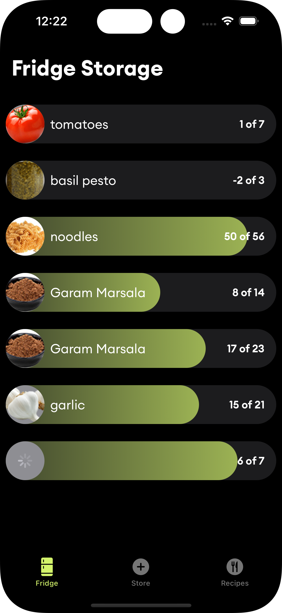

# Ramen

### [ 🚧 Work in progress 👷‍♀️⛏👷🔧️👷🔧 🚧 ] Ramen iOS Beta

  

## Background
Ramen project aimes to showcases the capabilities of Kotlin Multiplatform by developing an iOS application that enables users to monitor the contents of their refrigerator and receive suggestions for recipes. The project is open source and under development.


## Goals
- Develop a good quality iOS , watchOS application with seamles experince in step by step cooking.
- Bookmarking recipes for later use.
- Showing Nutritional facts.
- Syncing data to Firebase.
- User Authentication.
- Setup donation.
- **Android** is in the roadmap but it's not the main focus now.


## Building the project.
### Requirements
- Latest version of Android Studio, with KMM plugin.
- macOS Machince.
- Xcode.
### Building
- Open project in Android Studio.
- Assemble the `shared` module.
- Run the following commands in terminal.
```shell
cd IosApp && pod install
```
- Open the IosApp using the `workspace` in Xcode.
- Run the project, a Simulator should open with the app running.

## Support
- If you like this project, consider buying me a coffee!
- [](https://buymeacoffee.com/ahmed3elshaer)
